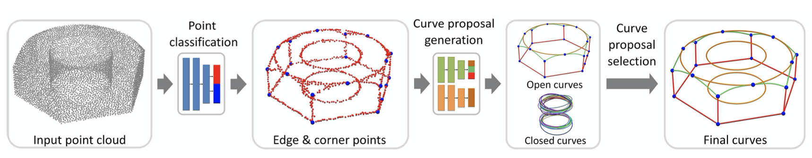

# PIE-NET: Parametric Inference of Point Cloud Edges

Xiaogang Wang, Yuelang Xu, Kai Xu, Andrea Tagliasacchi, Bin Zhou, Ali Mahdavi-Amiri, Hao Zhang

NeuIPS 2020 [paper](http://cn.arxiv.org/pdf/2007.04883v1)

We introduce an end-to-end learnable technique to robustly identify feature edges in 3D point cloud data. We represent these edges as a collection of parametric curves (i.e., lines, circles, and B-splines). The network relies on a region proposal architecture, where a first module proposes an over-complete collection of edge and corner points, and a second module ranks each proposal to decide whether it should be considered. We train and evaluate our method on the ABC dataset, the largest publicly available dataset of CAD models.

