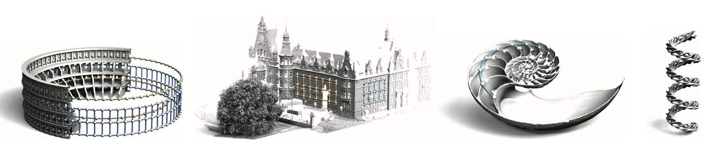

# **Discovering Structural Regularity in 3D Geometry**

Mark Pauly, Niloy J. Mitra, Johannes Wallner, Helmut Pottmann, Leonidas J. Guibas

SIGGRAPH 2008 [paper](http://graphics.stanford.edu/~niloy/research/structure/paper_docs/structure_sig_08.pdf)

We introduce a computational framework for discovering regular or repeated geometric structures in 3D shapes. We describe and clas- sify possible regular structures and present an effective algorithm for detecting such repeated geometric patterns in point- or mesh- based models. Our method assumes no prior knowledge of the ge- ometry or spatial location of the individual elements that define the pattern. Structure discovery is made possible by a careful anal- ysis of pairwise similarity transformations that reveals prominent lattice structures in a suitable model of transformation space.

