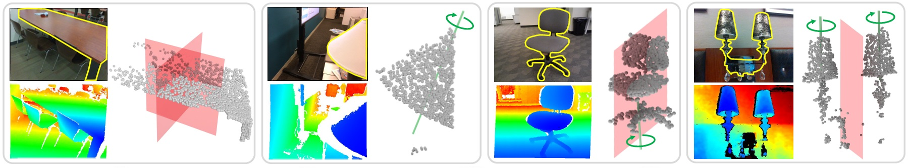

# **SymmetryNet: Learning to Predict Reflectional and Rotational Symmetries of 3D Shapes from Single-View RGB-D Images**

Yifei Shi, Junwen Huang, Hongjia Zhang, Xin Xu,  Szymon Rusinkiewicz, Kai Xu

SIGGRAPH Asia 2020 [project page](http://kevinkaixu.net/projects/symmetrynet.html)

First end-to-end deep neural network learns to predict both reflectional and rotational symmetries from single-view RGB-D images. It can detect the composition of an arbitrary number of symmetries, possibly of different types, present in the same object.