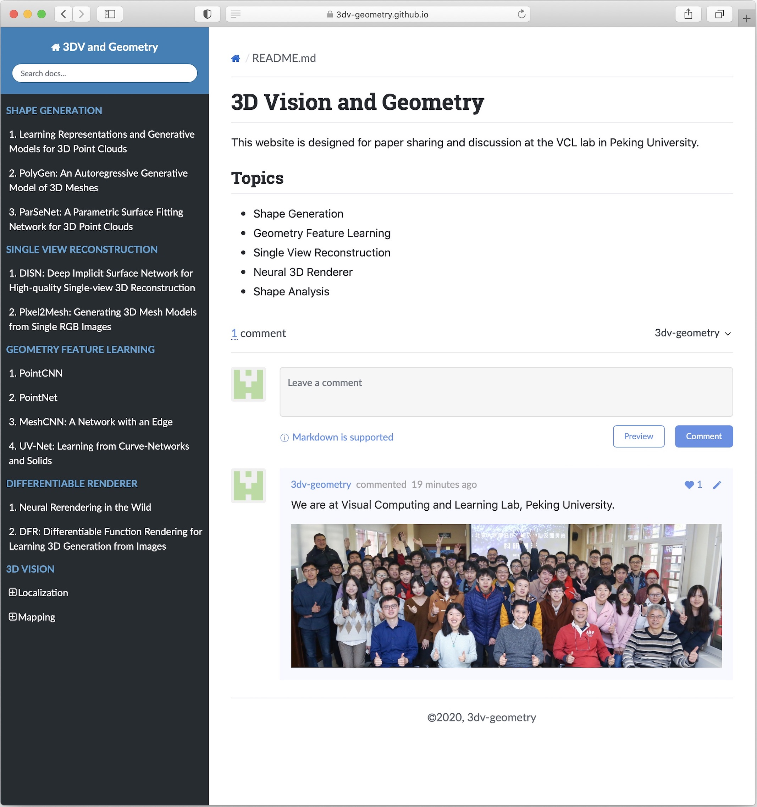
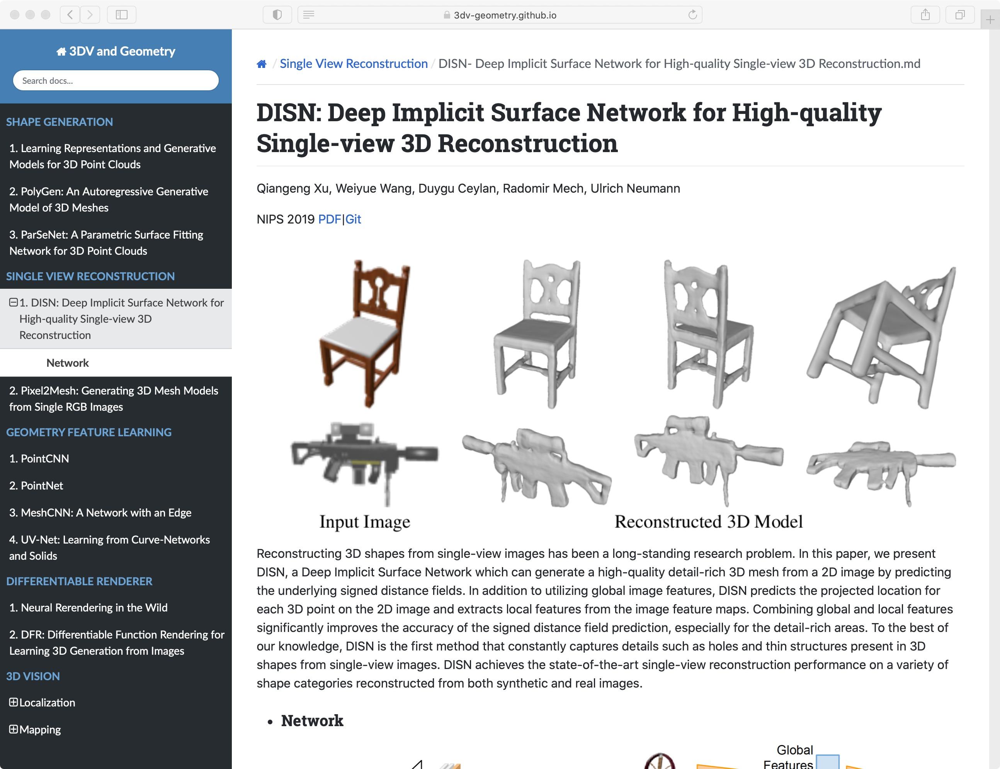
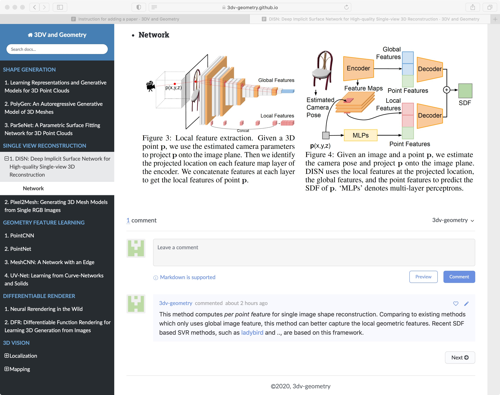
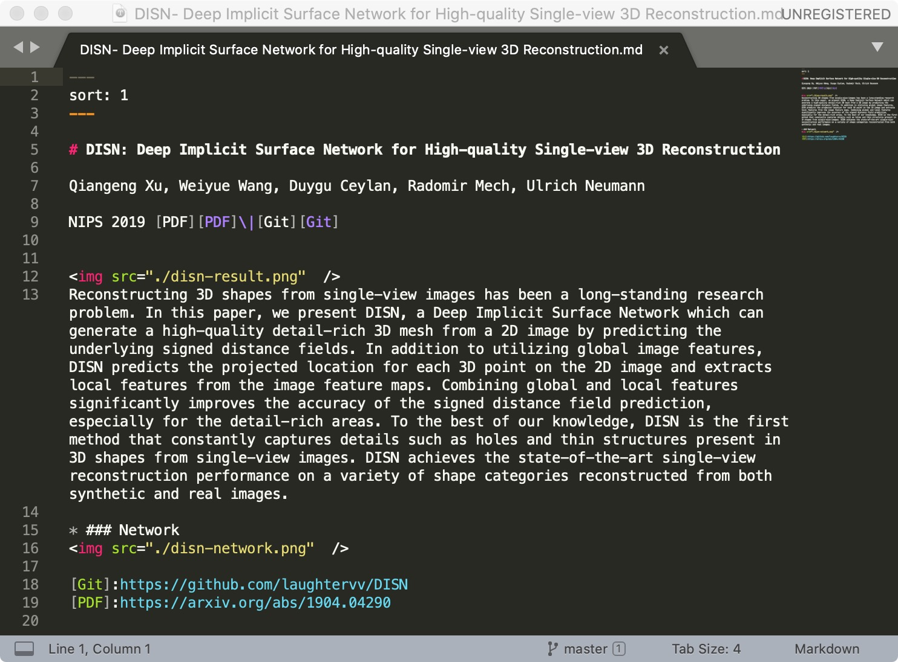
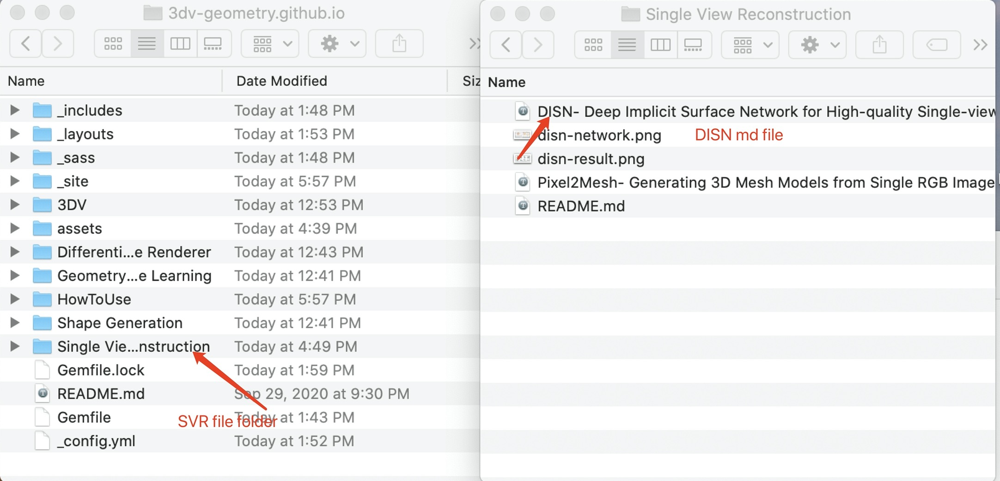

# Instruction for adding a paper

* ### Welcome to visit us, 3dv-geometry.github.io

* ### Find a research paper on the left sidebar 

* ### Leave your comments 
You can put image, equations and other non-text comments here. Check Github Markdown for more details.

* ### Add a research paper to this site
First, you need to be added as a collaborator.
You will use .md file, instead of html file, to prepare a paper page.

Remember to put the page in the *right* location. This is an example of how to organizing the papers.

