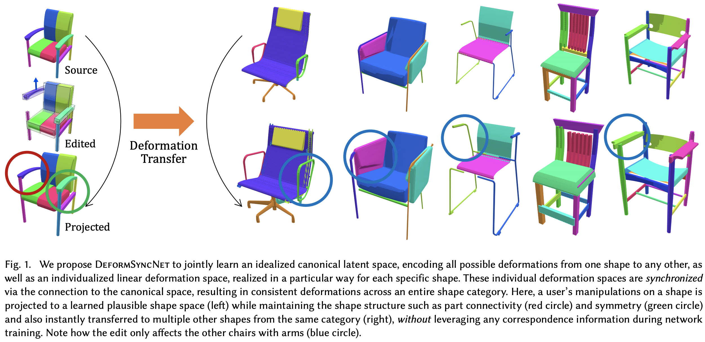
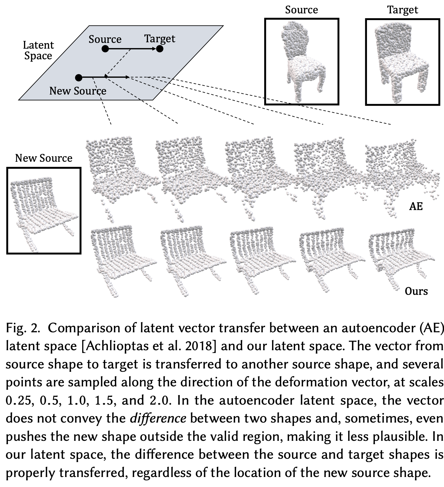

# DeformSyncNet: Deformation Transfer via Synchronized Shape Deformation Spaces

Minhyuk Sung*, Zhenyu Jiang*, Panos Achlioptas, Niloy J. Mitra, Leonidas J. Guibas (* equal contribution)

SIGGRAPH Asia 2020. [PDF][PDF]\|[Git][Git]

Shape deformation is an important component in any geometry processing toolbox. The goal is to enable intuitive deformations of single or multiple shapes or to transfer example deformations to new shapes while preserving the plausibility of the deformed shape(s). Existing approaches assume access to point-level or part-level correspondence or establish them in a preprocessing phase, thus limiting the scope and generality of such approaches. We propose DeformSyncNet, a new approach that allows consistent and synchronized shape deformations without requiring explicit correspondence information. Technically, we achieve this by encoding deformations into a class-specific idealized latent space while decoding them into an individual, model-specific linear deformation action space, operating directly in 3D. The underlying encoding and decoding are performed by specialized (jointly trained) neural networks. By design, the inductive bias of our networks results in a deformation space with several desirable properties, such as path invariance across different deformation pathways, which are then also approximately preserved in real space. We qualitatively and quantitatively evaluate our framework against multiple alternative approaches and demonstrate improved performance.

* ### Network

[Git]:https://github.com/Steve-Tod/DeformSyncNet
[PDF]:https://arxiv.org/abs/2009.01456