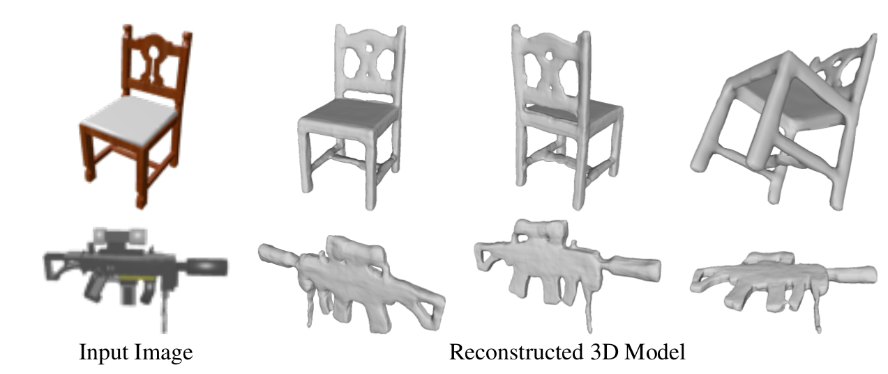
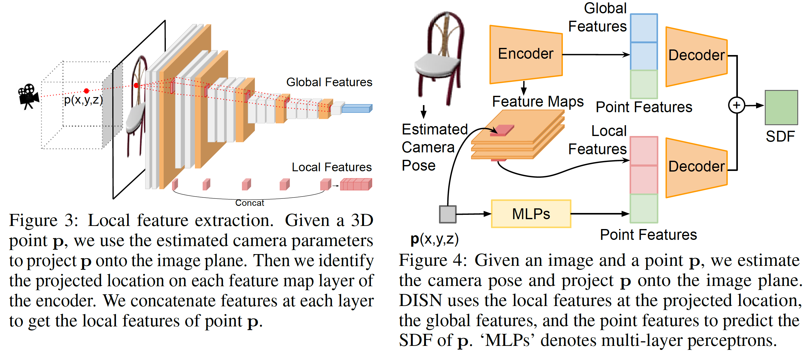

# DISN: Deep Implicit Surface Network for High-quality Single-view 3D Reconstruction

Qiangeng Xu, Weiyue Wang, Duygu Ceylan, Radomir Mech, Ulrich Neumann

NIPS 2019 [PDF][PDF]\|[Git][Git]

Reconstructing 3D shapes from single-view images has been a long-standing research problem. In this paper, we present DISN, a Deep Implicit Surface Network which can generate a high-quality detail-rich 3D mesh from a 2D image by predicting the underlying signed distance fields. In addition to utilizing global image features, DISN predicts the projected location for each 3D point on the 2D image and extracts local features from the image feature maps. Combining global and local features significantly improves the accuracy of the signed distance field prediction, especially for the detail-rich areas. To the best of our knowledge, DISN is the first method that constantly captures details such as holes and thin structures present in 3D shapes from single-view images. DISN achieves the state-of-the-art single-view reconstruction performance on a variety of shape categories reconstructed from both synthetic and real images.

* ### Network

[Git]:https://github.com/laughtervv/DISN
[PDF]:https://arxiv.org/abs/1904.04290
